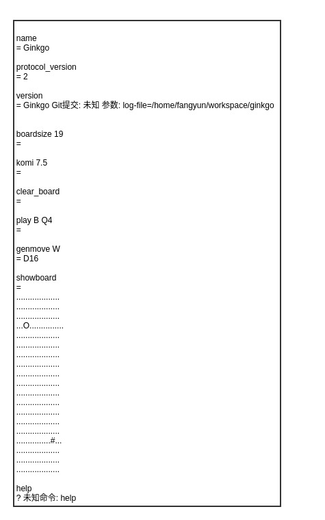
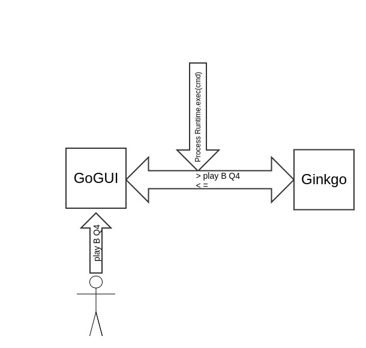
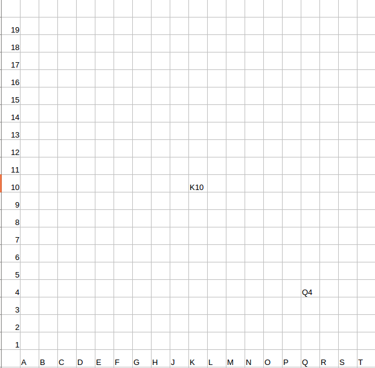
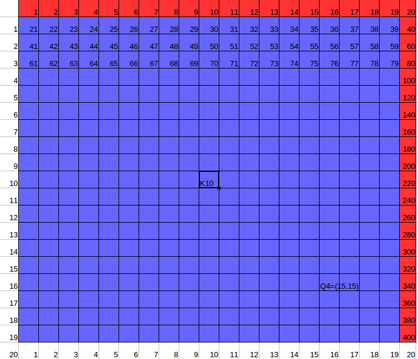
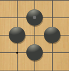
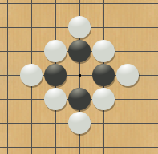

# 1. 分析点

1. Go Text Protocol（GTP）协议简介

   1. GTP的目的是提供一种灵活且易于实现的围棋程序通信协议。它的主要目的是允许两个程序互相对弈，但是它对于回归测试和与GUI或围棋服务器的通信也很有用。

   2. 该协议是不对称的，涉及两个方面，我们称之为控制器和引擎。控制器通常是某种仲裁者，而引擎通常是一个围棋程序。所有的通信都是由控制器以命令的形式发起的，引擎对此进行响应。

   3. 命令结构 

      一个命令只有一行长，语法为：
      [id] command_name [arguments]

      这里id是一个可选的标识号，command_name是一个字符串。行的其余内容给出了命令的参数。

   4. 响应结构
      如果成功，引擎将返回响应形式为：
      =[id] result
      这里'='表示成功，id是命令中给定的标识号，result是以两个连续换行结束的文本。

   5. 错误消息
      如果不成功，引擎将返回响应形式为：
      ?[id] error_message
      在这里的'?'表示失败，id是命令中给定的标识号，error_message给出了失败的解释，并以两个连续的换行结束。

   6. 图1，GTP通讯举例：

2. 怎样通过GTP协议实现人机下围棋的？以GoGui为例：

   1. GoGui调用 **Process java.lang.Runtime.exec(String[] cmdarray, String[] envp, File dir) throws IOException** 执行Ginkgo的java程序，得到此程序的进程Process
   2. 从进程Process对象中获得输入流InputStream和输出流OutputStream和错误流ErrorStream。
   3. GoGui开始通过这三个流（主要是输入流和输出流）与Ginkgo进程对话。其中对话协议遵循GTP.
   4. 图2，人机下围棋实现：

3. **short com.github.fangyun.ginkgo.core.CoordinateSystem.at(String)**的实现

   1. PASS和RESIGN，直接返回特殊值

   2. GTP协议中列坐标中没有字母I，需要避开字母I的处理。

   3. Label转换为行列(r,c), 然后计算at(r,c)

   4. at(r,c)=(1-base-r*20+1-base-c)

   5. 图3, 棋盘坐标：

      棋盘坐标(1维数组化后)：

      

4. **com.github.fangyun.ginkgo.core.CoordinateSystem.neighbors**的实现

   1. 是个2维数组：short\[400]\[8]=short\[p]\[{N,W,E,S,WN,EN,WS,ES}] // 上至下，左至右
   2. 所以对于遍历8个邻居时，如果是正交的邻居，只需选取范围[0,3]；对角邻居，则选取范围[4,7]

5. com.github.fangyun.ginkgo.core.Board.isSuicidal(StoneColor, short) 的实现

   1. 白棋自杀：邻居全异色且全不被打吃
   2. 黑棋自杀：邻居全同色且全被打吃

6. com.github.fangyun.ginkgo.core.Board.hashAfterRemovingCapturedStones(StoneColor, short)

   1. XOR异或：与0异或=自己，与1异或=反码
   2. 参见3 at [paper_review.md](paper_review.md)

7. com.github.fangyun.ginkgo.core.Board.finalizePlay(StoneColor, short)

   1. 更新点p的棋色
   2. 空点集合vacantPoints减去点p
   3. p=BLACK，Neighbors(WHITE)=0, (neighborCounts & MAX_COLOR_MASK[c.index()]) == MAX_COLOR_MASK[c.index()] = (256 & 32) =0 != 32 
   4. 按位与计算：同1为1，否则为0
   5. com.github.fangyun.ginkgo.core.Point.neighborCounts : 存储黑白空邻居的个数，每个计数使用3比特位来存储. = (000,001,010,011,100)所以需要3个bit位。
   6. 参考位掩码的性质。
   7. 通过枚举case来理解性质。

8. Point类

6. CoordinateSystem类

7. ShortSet类

8. Tables for Last Good Reply with Forgetting.

9. read book from data.

10. com.github.fangyun.ginkgo.feature.NotEyeLike.NotEyeLike

11. com.github.fangyun.ginkgo.feature.OnThirdOrFourthLine

12. com.github.fangyun.ginkgo.feature.NearAnotherStone.NearAnotherStone

13. com.github.fangyun.ginkgo.feature.LgrfTable.LgrfTable

14. com.github.fangyun.ginkgo.feature.LgrfSuggester

15. com.github.fangyun.ginkgo.feature.EscapeSuggester

16. com.github.fangyun.ginkgo.feature.PatternSuggester

17. com.github.fangyun.ginkgo.feature.CaptureSuggester

18. com.github.fangyun.ginkgo.move.SuggesterMover

19. com.github.fangyun.ginkgo.core.Board.isSuicidal(StoneColor, short) 

23. com.github.fangyun.ginkgo.core.SuperKoTable, 的意义与实现。（参考线性Hash）

24. com.github.fangyun.ginkgo.core.Board.getFancyHash() // Zobrist哈希

25. com.github.fangyun.ginkgo.mcts.RaveNode

26. com.github.fangyun.ginkgo.mcts.TranspositionTable.sweep()

27. com.github.fangyun.ginkgo.mcts.SimpleTreeUpdater

# 2. 参考文献

1. Matsumoto M, Nishimura T. Mersenne twister: a 623-dimensionally equidistributed uniform pseudo-random number generator[J]. Acm Transactions on Modeling & Computer Simulation, 1998, 8(1):3-30. http://ir.lib.hiroshima-u.ac.jp/files/public/1/15032/20141016122634147579/ACMTraModel_8_3.pdf
2. https://senseis.xmp.net/?ChineseGoTerms 
3. Baier H, Drake P D. The Power of Forgetting: Improving the Last-Good-Reply Policy in Monte Carlo Go[J]. IEEE Transactions on Computational Intelligence & Ai in Games, 2010, 2(4):303-309.
4. Specification of the Go Text Protocol, version 2, draft 2 , http://www.lysator.liu.se/~gunnar/gtp/gtp2-spec-draft2/gtp2-spec.html 
5. GoGui-1.4.9 https://sourceforge.net/projects/gogui/files/gogui/1.4.9